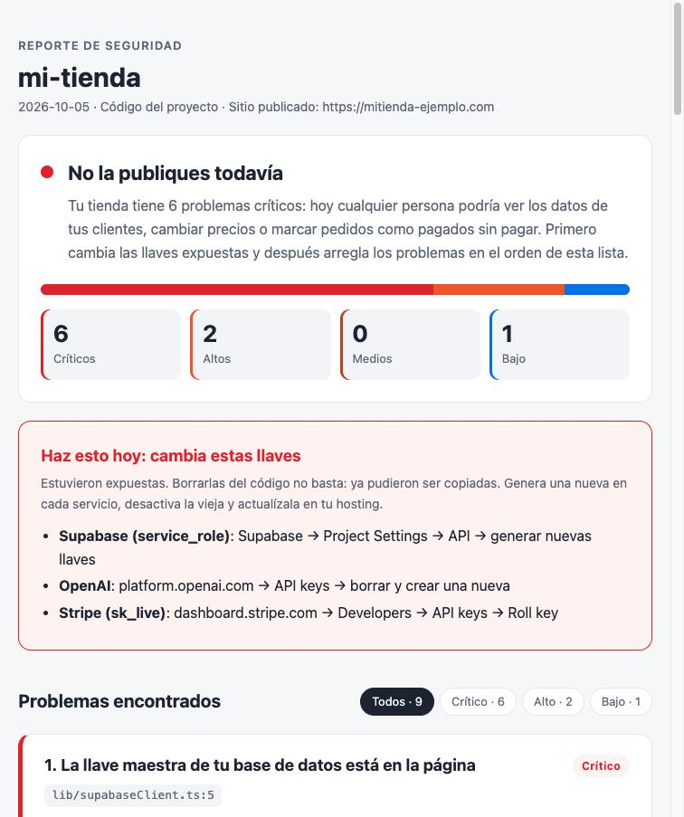
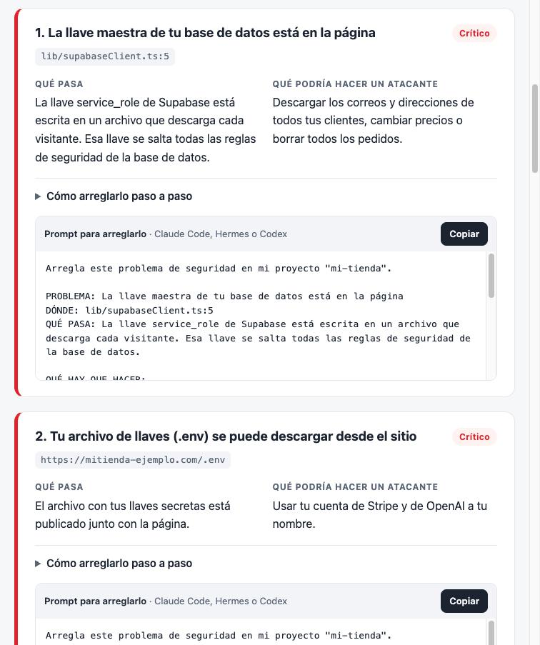
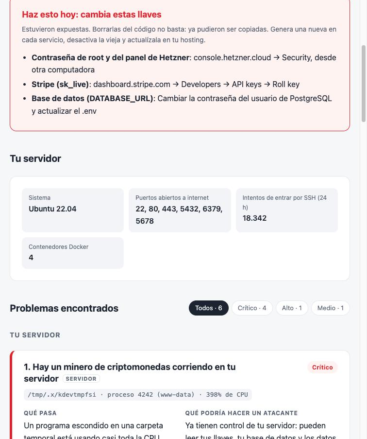

# Auditoría de seguridad para tu web (skill para Claude)

Revisa si tu página, tienda o app hecha con IA (Lovable, Bolt, v0, Cursor, Claude Code) se puede hackear. Revisa el **código**, el **sitio publicado** y tu **servidor VPS** por SSH. Te entrega un **reporte visual en HTML** con:
- Cada problema explicado en palabras simples.
- Qué podría hacer un atacante.
- **Un prompt listo para copiar** en Claude Code, Hermes o Codex para que lo arregle.

Está pensado para quienes **no son programadores**.



## Descargar

**[⬇ Descargar auditoria-seguridad-web.skill](https://github.com/christian-naicipa/seguridad_web/raw/main/auditoria-seguridad-web.skill)**

Es un archivo `.zip` con la carpeta `auditoria-seguridad-web/`. También puedes descargar ese código directamente desde este repositorio.

## Instalar

### Opción A: Claude Code (recomendada)
Claude puede revisar la carpeta de tu proyecto directamente.

Mac o Linux:
```bash
unzip auditoria-seguridad-web.skill -d ~/.claude/skills/
```

Windows: descomprime el archivo dentro de `C:\Users\<tu-usuario>\.claude\skills\`.

### Opción B: claude.ai o la app de Claude
1. En la configuración, ve a la sección de skills y sube el archivo `.skill`. Necesita tener activada la ejecución de código.
2. Sube tu proyecto en un `.zip` en el chat, porque Claude no ve las carpetas de tu computadora.

**Requisito:** Python 3.8 o más reciente. En Mac ya viene instalado; en Windows se instala desde [python.org](https://www.python.org/downloads/). No instala nada más.

## Usar

Abre Claude Code en la carpeta de tu proyecto y escribe algo como:

> revisa si mi tienda es segura, está publicada en https://mitienda.com

o simplemente *"¿me pueden hackear?"*. El skill se activa solo.

Vas a recibir:
1. **`SEGURIDAD-REPORTE.html`** en tu proyecto. Ábrelo en el navegador:
   - Un veredicto (¿la puedo publicar?) y un gráfico de problemas por gravedad.
   - **Haz esto hoy:** qué llaves cambiar y dónde se cambian.
   - Una tarjeta por problema con el botón **Copiar prompt**.
   - Lo que está bien, una lista para revisar a mano y los límites de la revisión.
2. Un resumen corto en el chat.
3. Una oferta para arreglarlo. Claude no modifica tu código sin permiso.



### Revisar tu VPS (servidor)

Si tu app está en un VPS (Hetzner, DigitalOcean, Hostinger, Contabo, AWS…), dile a Claude:

> revisa la seguridad de mi VPS, entro con `ssh root@203.0.113.10` y la tienda está en /var/www/tienda

Claude:
1. Se conecta por SSH, **solo para leer**.
2. Sube los escáneres a una carpeta temporal.
3. Revisa el servidor y el código de producción.
4. Prueba desde tu computadora qué puertos responden de verdad desde internet.
5. Borra todo lo que subió.

Necesitas entrar con **llave SSH**. Si hoy entras con contraseña, ejecuta una vez `ssh-copy-id usuario@IP` en tu terminal. Claude nunca te pide ni escribe contraseñas.

El reporte agrega la sección **"Tu servidor"**. Los prompts del servidor incluyen reglas para no quedarte fuera de tu VPS: respaldo antes de editar y probar el acceso en otra terminal antes de cerrar la actual.



Si tienes Claude Code o Hermes dentro del VPS, también puedes correrlo ahí: `sudo python3 auditoria-seguridad-web/scripts/escanear_servidor.py`.

Ejemplos para descargar y abrir en el navegador:
- [`ejemplo/reporte-ejemplo.html`](ejemplo/reporte-ejemplo.html): una tienda.
- [`ejemplo/reporte-vps-ejemplo.html`](ejemplo/reporte-vps-ejemplo.html): un VPS hackeado.

## Qué revisa

| Tema | Ejemplos |
|---|---|
| Llaves expuestas | OpenAI, Claude, Stripe, Supabase `service_role`, Shopify, Mercado Pago, AWS, GitHub, Telegram, en el código o en el JavaScript publicado |
| Archivos `.env` | Subidos a git (incluso en el historial), publicados en el sitio o con prefijo público (`NEXT_PUBLIC_`, `VITE_`) |
| Base de datos | Supabase sin RLS o con políticas `true`, Firebase con `if true` o en modo de prueba |
| Accesos | Paneles `/admin` sin login, endpoints que borran usuarios o crean descuentos sin verificación |
| Pagos | Precio que viene del navegador, webhooks de Stripe, Shopify o Mercado Pago sin verificar la firma |
| Chatbots con IA | Bots que pueden dar reembolsos o cupones, prompt injection, endpoints sin límite de uso |
| Dependencias | Next.js con vulnerabilidades conocidas, `npm audit` |
| Sitio publicado | `/.env` y `/.git` expuestos, HTTPS, cabeceras de seguridad, source maps |
| **VPS: puertos** | PostgreSQL, MySQL, Redis o MongoDB abiertos a internet; paneles (n8n, Portainer, Coolify, pgAdmin) expuestos; API de Docker abierta |
| **VPS: Docker** | Puertos publicados que se saltan el firewall (ufw no los bloquea), contenedores privilegiados o con `docker.sock` |
| **VPS: acceso** | SSH con contraseña o root con contraseña, sin fail2ban, usuarios sin contraseña, llaves SSH que no reconoces |
| **VPS: mantenimiento** | Firewall apagado, parches de seguridad pendientes, sistema sin soporte, disco lleno |
| **VPS: ¿ya me hackearon?** | Mineros de criptomonedas, programas en `/tmp`, tareas programadas con `curl \| sh`, rootkits (`ld.so.preload`), usuarios ocultos con poderes de root |
| **VPS: recuperación** | Sin backups automáticos, certificados HTTPS vencidos o por vencer, `.env` legibles por cualquiera, nginx publicando `.env` o `.git` |

Lo que no se puede ver en el código (backups, verificación en dos pasos, el panel de Supabase) aparece como una lista para revisar a mano.

**Todo es de solo lectura:** en el sitio publicado solo hace peticiones GET, y en el VPS solo lee la configuración. No cambia nada, no ataca nada y no revisa sitios ni servidores que no sean tuyos.

## Cómo funciona

1. **`scripts/escanear.py`** busca los problemas con reglas fijas y repetibles. Las llaves que encuentra salen enmascaradas.
2. **Claude** confirma cada hallazgo leyendo el código, descarta las falsas alarmas y busca lo que un script no ve, como el acceso a datos de otros usuarios.
3. **`scripts/escanear_servidor.py`** revisa el VPS por dentro, y **`scripts/auditar_vps.py`** lo ejecuta por SSH desde tu computadora y prueba los puertos desde fuera.
4. **`scripts/generar_reporte.py`** arma el HTML con un diseño fijo, sin depender de internet. Escapa todo el texto y enmascara cualquier llave que se haya colado.

## Pruebas

Las pruebas crean apps con vulnerabilidades plantadas:
- Next.js con Supabase.
- Firebase con un chatbot.
- Una app de Shopify.
- Una tienda bien hecha, para medir falsas alarmas.
- Dos sitios publicados de prueba.
- Dos servidores VPS simulados: uno hackeado y mal configurado, y otro bien configurado.

Luego verifican que los escáneres detecten todo, que no den falsas alarmas, que el reporte nunca muestre llaves completas y que la auditoría del VPS no deje archivos en el servidor.

```bash
python3 pruebas/test_escanear.py
```

Todas las llaves de las pruebas son falsas.

También se comparó Claude con y sin el skill sobre 4 casos:

| | Con skill | Sin skill |
|---|---|---|
| Revisiones correctas | **38/38 (100%)** | 35/38 (92%) |
| Muestra llaves completas | Nunca | Una vez |

## Límites

Ninguna herramienta garantiza seguridad al 100%. El skill revisa los errores más comunes en proyectos hechos con IA. No reemplaza una auditoría profesional si manejas pagos o datos sensibles a gran escala.
